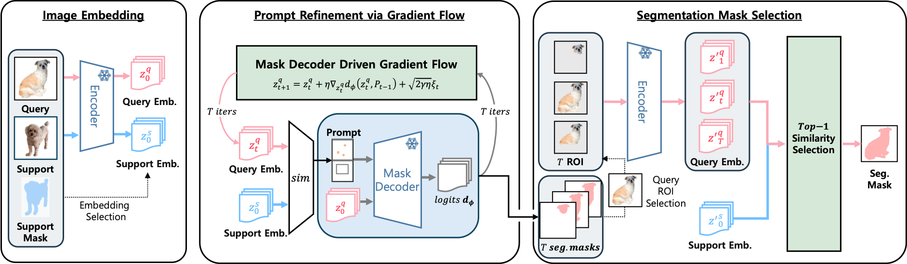

# PR-MaGIC: Prompt Refinement Via Mask Decoder Gradient Flow For In-Context Segmentation

**Minjae Lee\*, Sungwoo Hur\*, Soojin Hwang, Won Hwa Kim**
Pohang University of Science and Technology (POSTECH)
\* Equal contribution

[[Project Page](https://postech-minjaelee.github.io/PR-MaGIC/)] [[Paper](paper.pdf)]

---

## Overview

PR-MaGIC is a **training-free, test-time** prompt refinement framework for in-context (one/few-shot) segmentation. It improves the prompt quality of existing auto-prompting segmentation methods (PerSAM-F, Matcher) by iteratively updating the query image embedding via **gradient flow derived from SAM's mask decoder**, then selecting the best candidate mask using top-1 support–query similarity.



### Key features

- **Training-free**: no learnable parameters, no architectural modifications, no extra data.
- **Plug-and-play**: integrates directly into PerSAM-F and Matcher without modifying their code.
- **Top-1 mask selection**: among T candidate masks, selects the one most similar to the support embedding, providing robustness against step-size sensitivity and sample variability.

---

## Results

mIoU (%) on six benchmarks. **B** = Baseline, **T** = PR-MaGIC (Top-1 selection), **O** = PR-MaGIC (Oracle).

| Method | FSS B/T/O | COCO B/T/O | LVIS B/T/O | PACO B/T/O | Pascal B/T/O | DIS B/T/O |
|---|---|---|---|---|---|---|
| PerSAM-F | 58.41 / **67.19** / 72.45 | 44.64 / **46.83** / 51.74 | 42.37 / **44.48** / 47.29 | 39.60 / **40.72** / 43.39 | 42.72 / **43.87** / 46.43 | 46.82 / **49.99** / 53.46 |
| Matcher (1-shot) | 92.08 / 92.06 / 93.55 | 69.53 / **71.23** / 76.14 | 59.39 / **61.52** / 64.75 | 50.27 / **54.08** / 56.71 | 54.76 / **58.28** / 61.13 | 46.65 / **55.08** / 58.10 |
| Matcher (5-shot) | 93.26 / **93.41** / 94.32 | 67.69 / **70.74** / 74.88 | 57.14 / **60.79** / 63.88 | 48.66 / **53.15** / 55.30 | 54.54 / **59.27** / 61.55 | — |

---

## Installation

```bash
git clone https://github.com/POSTECH-MinjaeLee/PR-MaGIC.git
cd PR-MaGIC

conda env create -f env.yml
conda activate pr-magic
```

**Python 3.10 / PyTorch 2.0.1 / CUDA 11.7**

---

## Weights

```bash
bash scripts/download_weights.sh          # download SAM ViT-H + DINOv2 ViT-L/14
# or individually:
bash scripts/download_weights.sh --sam
bash scripts/download_weights.sh --dinov2
```

Weights are saved to `weights/`:
```
weights/
├── sam_vit_h_4b8939.pth
└── dinov2_vitl14_pretrain.pth
```

---

## Data Preparation

Run the following to see download instructions for all six datasets:

```bash
bash scripts/prepare_data.sh
```

Expected `data/` structure after setup:

```
data/
├── COCO2014/
│   ├── train2014/  val2014/
│   └── annotations/{train2014,val2014}/  splits/
├── FSS-1000/
│   └── data/{class}/  splits/{trn,val,test}.txt
├── LVIS/
│   └── coco/{train2017,val2017}/  lvis_{train,val}.pkl
├── PACO-Part/
│   └── coco/{train2017,val2017}/  paco/paco_part_{train,val}.pkl
├── Pascal-Part/
│   └── VOCdevkit/VOC2010/
└── DIS5K/
    ├── Train/{im,gt}/{1-1,...,1-210}/
    └── Test/{im,gt}/
```

For DIS5K, reorganize into the class-subdirectory format after downloading:

```bash
python scripts/prepare_dis5k.py --dis5k_root <path>/DIS5K
ln -s <path>/DIS5K data/DIS5K
```

---

## Running

### PerSAM-F + PR-MaGIC

```bash
# Single run (from Personalize-SAM/)
cd Personalize-SAM
python pr_magic_for_persam.py \
    --benchmark fss --fold 0 --seed 42 \
    --points_num 5 --nested 6 \
    --eta 1e-3 --gamma 1e-1 \
    --alpha_list 0.0 --beta_list 0.0 \
    --log-root ../results/persam/fss/f0_s42

# All benchmarks via launcher (from PR-MaGIC root)
python scripts/launch_persam_pr.py --benchmarks fss coco lvis --gpus 0,1,2
```

### Matcher + PR-MaGIC

```bash
# Single run (from Matcher/)
cd Matcher
python pr_magic_for_matcher.py \
    --benchmark fss --fold 0 --seed 42 \
    --nshot 1 --nested 6 \
    --eta 1e-3 --gamma 1e-1 \
    --alpha 0.8 --beta 0.2 --exp 1.0 \
    --num_merging_mask 10 \
    --alpha_list 0.0 --beta_list 0.0 \
    --log-root ../results/matcher/fss/f0_n1_s42

# All benchmarks via launcher (from PR-MaGIC root)
python scripts/launch_matcher_pr.py --benchmarks fss coco lvis --gpus 0,1,2
```

### Hyperparameters

| Setting | η | γ | T (Includes first result) | points (PerSAM) | num_centers (Matcher) |
|---|---|---|---|---|---|
| Semantic (FSS, COCO, LVIS) | 1e-3 | 0.1 | 6 | 5 | 8 |
| Part (PACO, Pascal, DIS) | 1e-4 | 0.1 | 6 | 3 | 5 |

---

## Citation

```bibtex
@inproceedings{lee2025prmagic,
  title     = {PR-MaGIC: Prompt Refinement Via Mask Decoder Gradient Flow For In-Context Segmentation},
  author    = {Lee, Minjae and Hur, Sungwoo and Hwang, Soojin and Kim, Won Hwa},
  booktitle = {Proceedings of the IEEE/CVF Conference on Computer Vision and Pattern Recognition (CVPR)},
  year      = {2026}
}
```

---

## Acknowledgements

This repository builds on [PerSAM](https://github.com/ZrrSkywalker/Personalize-SAM) and [Matcher](https://github.com/aim-uofa/Matcher). We thank the authors for their excellent work.
